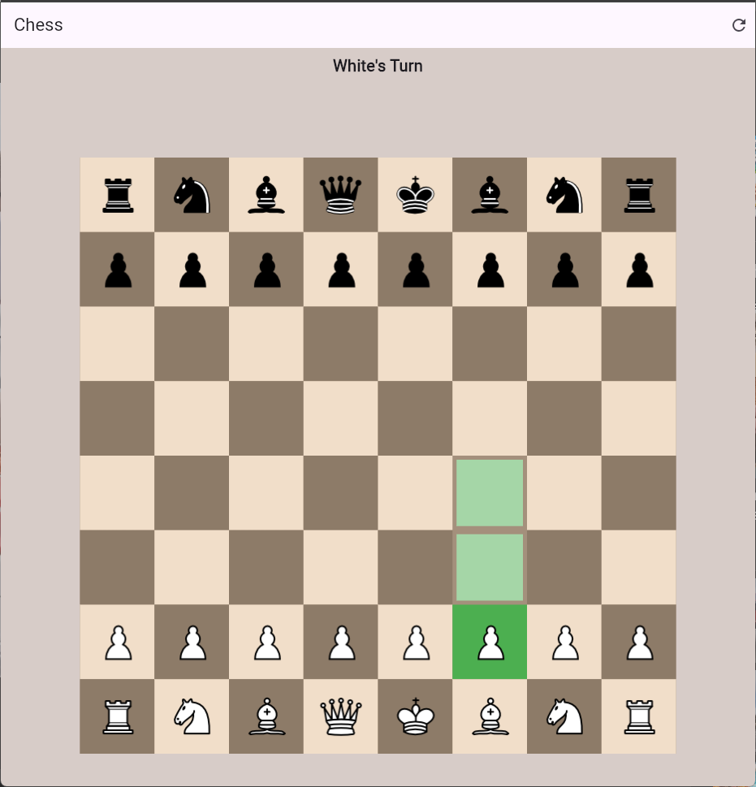
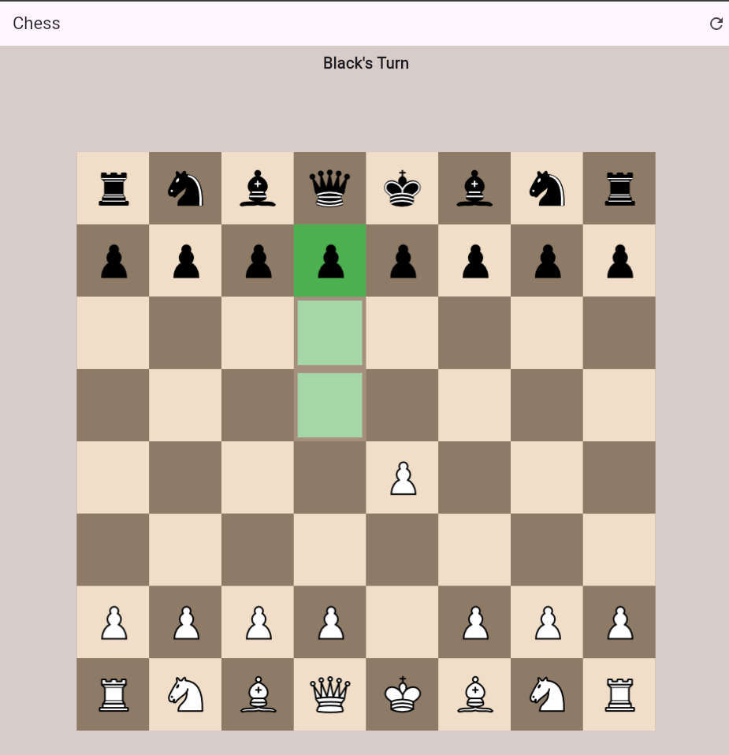
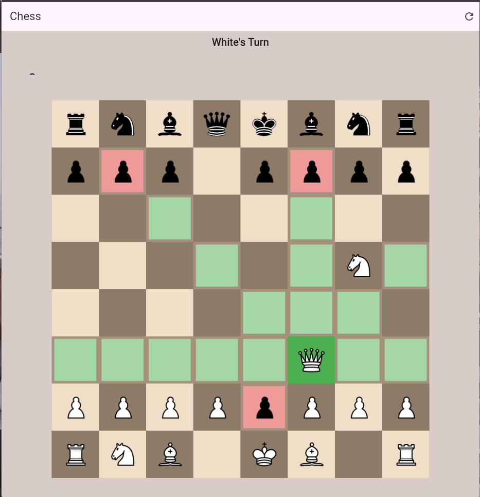
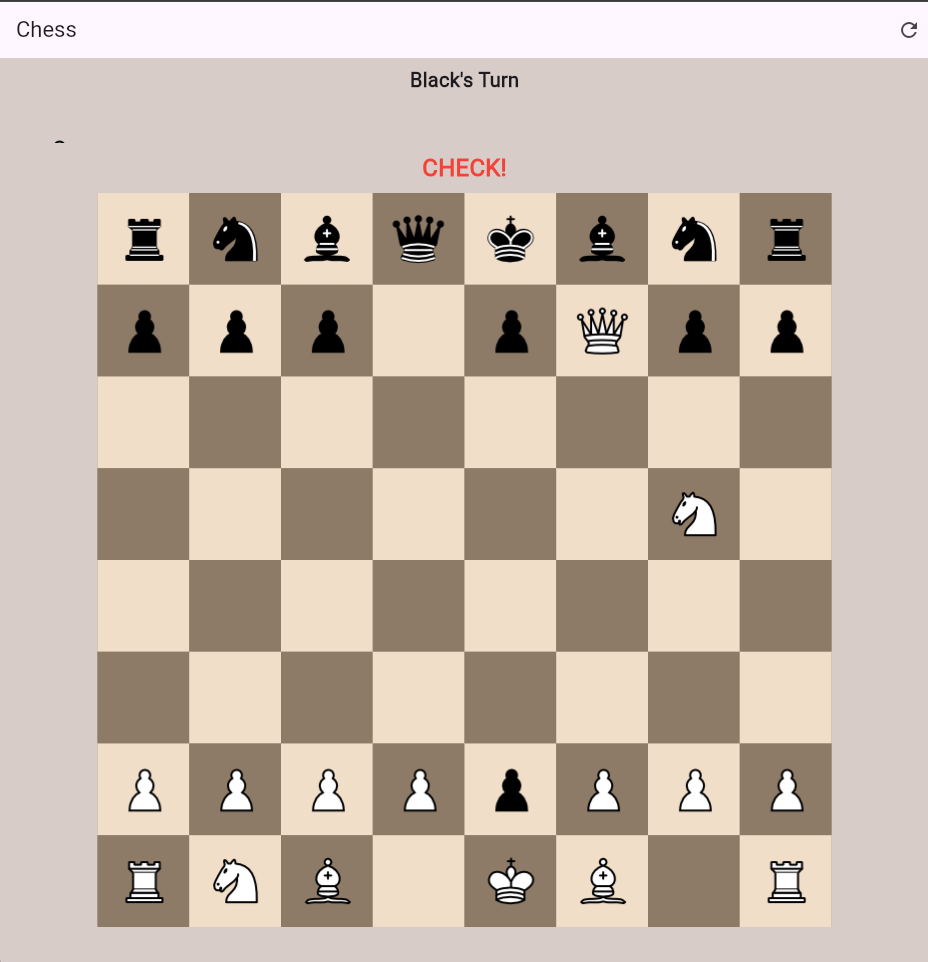
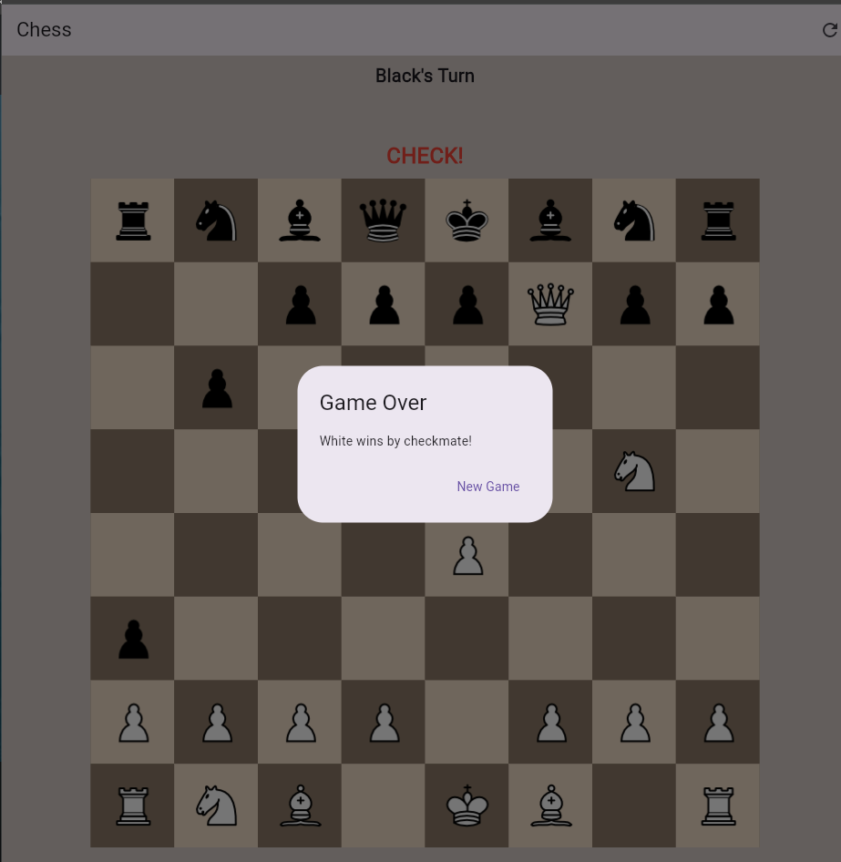

# Overview


A Flutter-based chess game implementing standard chess rules, including checkmate, stalemate, castling, en passant, and pawn promotion. The app features a clean UI with turn indicators, captured piece displays, and a reset option.

## Features
- Complete chess rules: move validation, check/checkmate/stalemate detection, castling, en passant, and pawn promotion.
- Intuitive UI with visual feedback for valid moves, captures, and check status.
- Turn indicator and captured piece display.
- Reset game functionality.
- Optimized performance with image precaching.
- **Testing**: Unit tests for pawn move validation and widget tests for Square component.
- **CI/CD**: Automated testing and APK builds via GitHub Actions.

## Screenshots
The following screenshots showcase the app's UI and key game states:

| White to Move | Black to Move | Move Check | Check | Checkmate |
|---------------|---------------|------------|-------|-----------|
|  |  |  |  |  |

## Getting Started

### Prerequisites
- Flutter SDK (version 3.22.2 or higher)
- Dart
- An IDE (e.g., VS Code, Android Studio)
- Emulator or physical device for testing

### Installation
1. Clone the repository:
   ```bash
   git clone https://github.com/Vaibhav23rd/ci-cd_chess_game.git
   ```
2. Navigate to the project directory:
   ```bash
   cd ci-cd_chess_game
   ```
3. Install dependencies:
   ```bash
   flutter pub get
   ```
4. Ensure you have the required assets (chess piece images) in the `assets/images/` directory.
5. Run the app:
   ```bash
   flutter run
   ```
6. Run tests:
   ```bash
   flutter test
   ```


## How to Play
- Tap a piece to select it; valid moves are highlighted (green for moves, red for captures).
- Tap a highlighted square to move the piece.
- The app indicates whose turn it is and shows captured pieces.
- If a pawn reaches the opponent's back rank, a promotion dialog appears.
- Use the reset button in the app bar to start a new game.
- The game ends with a dialog for checkmate or stalemate.

## Technical Highlights
- **Game Logic**: Implements complex chess rules with edge cases like en passant and castling.
- **Testing**: Includes unit tests for pawn move validation (e.g., initial two-square moves) and widget tests for Square rendering.
- **CI/CD**: GitHub Actions automates testing and APK builds, ensuring code quality.
- **Performance**: Uses image precaching to optimize asset loading.

## Future Improvements
- Add an AI opponent using a minimax algorithm.
- Implement move history and undo functionality.
- Add sound effects for moves and captures.
- Support online multiplayer with a backend.

## Contributing
Contributions are welcome! Please open an issue or submit a pull request on GitHub.

## License
This project is licensed under the MIT License.
